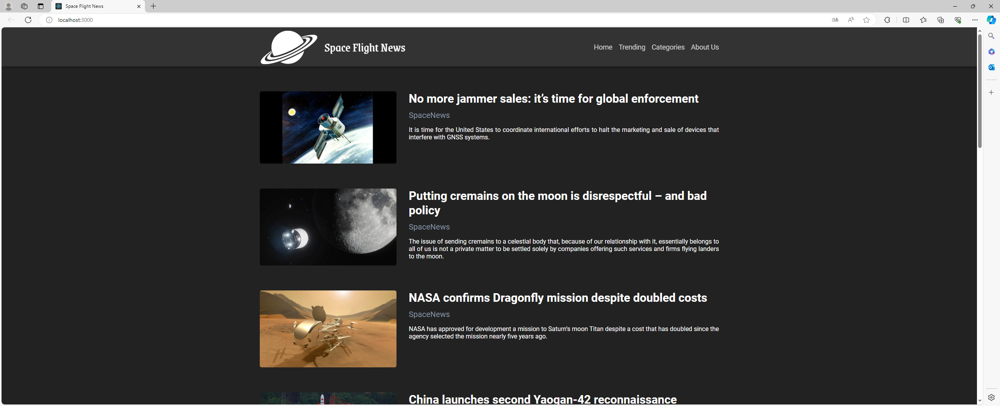

# Space Flight News 
Welcome to the Space Flight News website, an innovative platform designed to keep you updated on the latest developments and discoveries in space exploration. Powered by React and the Spaceflight News API, our platform offers a seamless experience for enthusiasts and professionals alike.

[](https://github.com/katherineuchoas/space-flight-news/blob/9f2cc851490aa2e79916a272874a948629e45ef8/src/assets/images/behavior.PNG)


## 🚀 Technologies

This project is built upon cutting-edge technologies to ensure reliability and efficiency:

-  **[React.js](https://reactjs.org/)** 
-   **[JavaScript](https://developer.mozilla.org/en-US/docs/Web/JavaScript)**


## ⚠️  Dependencies

Before diving into the project, make sure you have the following tools installed on your machine:
[Git] ([https://git-scm.com](https://git-scm.com/)), [Node.js] ([https://nodejs.org/en/](https://nodejs.org/en/)). In addition, it is good to have an editor to work with the code like [VSCode] ([https://code.visualstudio.com/](https://code.visualstudio.com/))

   

## 🌌  Explore the Cosmos

Dive into the realm of space exploration with Space Flight News. Stay informed, stay inspired.
  
```bash  
  
# Clone this repository  
  
$  git  clone  https://github.com/katherineuchoas/space-flight-news.git
  
  
# Access the project folder in your terminal  
  
$  cd  space-flight-news
  
  
# Install the dependencies

$ npm install
  
  
# Run the application  
  
$ npm run start


```  
  
---
  
Made by  [Katherine Uchoas Rodrigues](https://github.com/katherineuchoas) 
